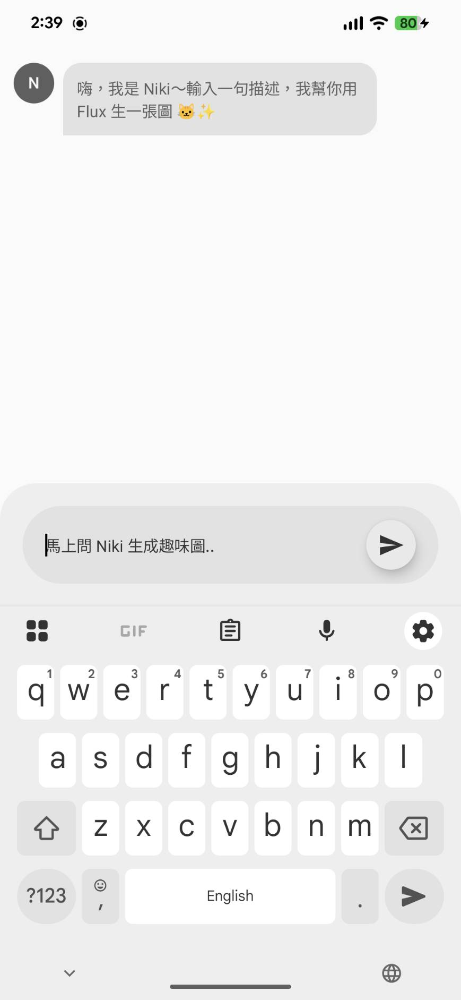
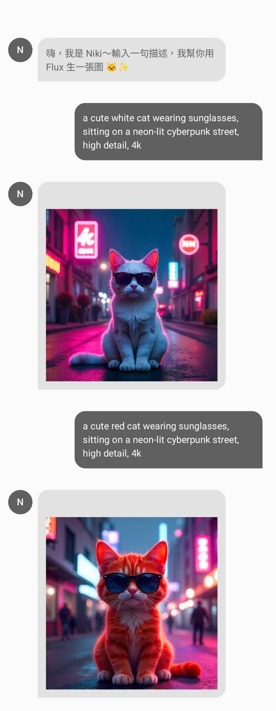

# Alex Stable Diffusion Chat Compose

一個使用 **StableDiffusionAPI.com** 的 Android 範例專案，  
透過聊天介面輸入 Prompt，由「Niki」幫你用 **Flux** 模型即時生成圖片。

- 語言：Kotlin
- UI：Jetpack Compose
- DI：Hilt
- 網路層：Retrofit + Kotlin Serialization
- 圖片載入：Coil
- 架構：Clean-ish (Data / Domain / Presentation)，使用 `Resource` 封裝結果

---

## 📸 Demo


|                             |                                |
|-----------------------------|--------------------------------|
|  |     |

- Chat 氣泡 UI（User / Bot）
- 送出 Prompt 後，生成完成後顯示圖片：

---

## ✨ 功能特色

- ChatGPT 風格聊天室 UI
  - 左側 Niki（Bot）氣泡 / 右側使用者氣泡
  - 支援純文字訊息與圖片訊息
- 文生圖（Text-to-Image）
  - 使用 StableDiffusionAPI.com 的 `text2img` 端點
  - 預設模型：`model_id = "flux"`
  - 請求參數：`prompt / width / height / samples / num_inference_steps / guidance_scale ...`
- 請求狀態管理
  - 自訂 `Resource<Success, Error>` 封裝結果
  - `ChatViewModel` 以 `UiState` + `StateFlow` 管理畫面狀態
  - 送出時顯示打字中動畫（`BouncingDotsLoading`），回應後替換為圖片泡泡
- Clean Code
  - Data：Retrofit + DTO + Mapper
  - Domain：Repository Interface + UseCase + Domain Model
  - Presentation：ViewModel + Compose UI

---

## 🧱 專案結構（重點檔案）

> 只列出與 Stable Diffusion Chat 相關的主要檔案

```text
app/
 └─ src/main/kotlin/com/alex/yang/stablediffusionchatcompose/
    ├─ App.kt                         // @HiltAndroidApp Application
    ├─ MainActivity.kt                // 入口 Activity，掛上 ChatScreen
    ├─ core/
    │   └─ common/Resource.kt         // Resource<Success, Error> 封裝
    │
    ├─ di/
    │   └─ ApiModule.kt               // OkHttp + Retrofit + Json + StableDiffusionApi 綁定
    │
    ├─ feature/chat/
    │   ├─ data/
    │   │   ├─ remote/
    │   │   │   ├─ StableDiffusionApi.kt   // Retrofit interface (text2img)
    │   │   │   ├─ Text2ImgRequest.kt      // Text-to-Image Request DTO
    │   │   │   └─ Text2ImgDto.kt          // Text-to-Image Response DTO
    │   │   ├─ mapper/
    │   │   │   └─ Text2ImgMapper.kt       // Text2ImgDto.toDomain()
    │   │   └─ repository/
    │   │       ├─ ChatRepository.kt       // Domain Repository 介面
    │   │       └─ ChatRepositoryImpl.kt   // 實作：呼叫 API + Mapper + Resource
    │   │
    │   ├─ domain/
    │   │   ├─ model/Text2Img.kt          // Domain Model: id + imageUrl + meta...
    │   │   └─ usecase/FetchText2ImgUseCase.kt  // 呼叫 Repository 的 UseCase
    │   │
    │   └─ presentation/
    │       ├─ ChatMessage.kt             // ChatMessage + Sender Enum
    │       ├─ ChatViewModel.kt           // UiState + sendMessage() + BouncingDots
    │       ├─ ChatScreen.kt              // 整體畫面：LazyColumn + BottomAskSection
    │       ├─ ChatMessageRow.kt          // 單則訊息氣泡 + 圖片 UI
    │       ├─ ChatBinds.kt               // 封裝 ChatScreen 綁定邏輯（若有）
    │       ├─ component/
    │       │   ├─ BouncingDotsLoading.kt // 送出後的打字中動畫
    │       │   ├─ BottomAskSection.kt    // 底部輸入區容器
    │       │   └─ NikiAskBar.kt          // 輸入欄 + 送出按鈕（FloatingActionButton）
    │       │
    │       └─ ui/theme/                  // Color / Theme / Typography
    │
    └─ ...
````

---

## 🔧 技術棧與版本

* **語言**

    * Kotlin
* **UI**

    * Jetpack Compose
    * Material3
* **DI**

    * Hilt
* **網路層**

    * Retrofit
    * OkHttp + Logging Interceptor
    * Kotlinx Serialization
* **圖片**

    * Coil Compose
* **非同步**

    * Kotlin Coroutines
    * StateFlow / MutableStateFlow
* **其他**

    * `Resource<T>` 封裝成功 / 失敗

---

## ⚙️ 安裝與執行

### 1. 取得 StableDiffusionAPI.com API Key

1. 到 StableDiffusionAPI.com / ModelsLab 註冊帳號
2. 在 Dashboard 建立 API Key
3. 把 Key 記錄下來（後面 Gradle 要用）

> 注意：本專案使用 `text2img` Flux 模型，請確認你的帳號方案支援該模型。

---

### 2. 設定 API Key（建議用 local.properties）

在專案根目錄的 `local.properties` 增加：

```properties
STABLE_DIFFUSION_API_KEY=你的實際APIKey
```

---
## 🌐 StableDiffusionAPI：Text-to-Image 端點

### Endpoint

```http
POST https://stablediffusionapi.com/api/v5/text2img
Content-Type: application/json
```

---
## 🧪 測試方式

1. Build & Run app 至模擬器或實機
2. 進入主畫面後：

    * 在輸入框輸入 prompt，例如：

      > `a cute white cat wearing sunglasses, sitting on a neon-lit cyberpunk street, high detail, 4k`
    * 點右下角送出按鈕
3. 流程預期：

    * 右側出現你的文字訊息
    * 左側出現 Niki 的 `...` 打字動畫
    * 幾秒後動畫消失，換成 Flux 生成的圖片卡片

---

## 🚀 未來擴充方向

* 支援多模型切換（Flux / SDXL / Anime 等）
* 加入 negative prompt、strength、scheduler 等進階參數
* 支援圖生圖（Image-to-Image / Upscale / Face Restore）
* 加入圖片點擊放大 / 儲存 / 分享功能

---
## 👤 Author

**Alex Yang**  
Android Engineer
🌐 [github.com/m9939418](https://github.com/m9939418)
